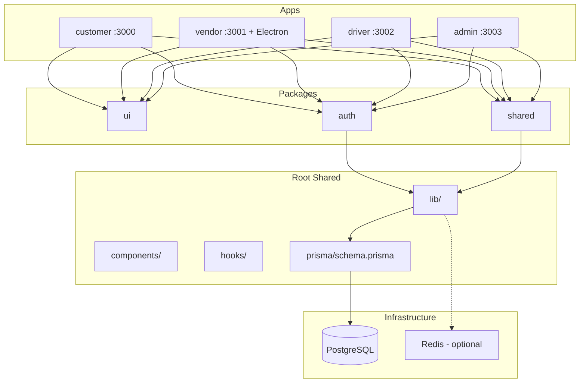

# AL-baz Delivery Project Analysis

**Date**: February 11, 2026  
**Status**: Architecture analysis and improvement recommendations

---

## Architecture Overview

---

## App Inventory and Ports

| App | Port | Description |
|-----|------|-------------|
| **customer** | 3000 | Customer-facing app for browsing stores, placing orders |
| **vendor** | 3001 | Vendor dashboard + POS; also packaged as Electron desktop app |
| **driver** | 3002 | Driver app for delivery management |
| **admin** | 3003 | Admin control panel for users, analytics, approvals |

---

## Current Setup Summary

- **Monorepo**: Turborepo with workspaces `apps/*` and `packages/*`
- **Database**: Single PostgreSQL via Prisma; one schema at `prisma/schema.prisma`
- **Auth**: NextAuth.js v5; shared config in `lib/auth.config.ts`; `packages/auth` re-exports from root
- **Shared resources**: lib/, components/, hooks/ at root; packages: ui, shared, auth

---

## Database: One vs Multiple per App

### Recommendation: **One database for all apps** (keep current approach)

**Reasons**:
1. **Shared domain model**: Orders span customer → vendor → driver. Users, stores, products, payments are cross-app entities.
2. **ACID transactions**: Order lifecycle (create → accept → prepare → assign → deliver) needs a single source of truth.
3. **Simpler operations**: One migration pipeline, one backup, one connection pool.
4. **Prisma schema design**: `prisma/schema.prisma` is built for shared access (User roles, Order relations across customer/vendor/driver).
5. **Monorepo fit**: Root-level Prisma, shared `lib/prisma.ts`; splitting DBs would require schema duplication, sync, and complex joins.

**When to consider separate databases**:
- If apps become independent products with unrelated data
- If strict compliance requires data isolation (e.g. per-tenant DBs)
- If one app has very different scalability/performance requirements

For AL-baz Delivery, **keep a single database**.

---

## NextAuth URL: One vs Per-App

### Recommendation: **Per-app NEXTAUTH_URL** (app-specific)

**Reasons**:
1. **Different origins**: Each app runs on its own port/domain (localhost:3000, 3001, etc.; `app.*`, `vendor.*`, `admin.*` in prod).
2. **Cookie scope**: NextAuth sets cookies for the URL origin. If vendor uses `NEXTAUTH_URL=https://vendor.example.com`, cookies are scoped to that domain.
3. **OAuth callbacks**: Google OAuth redirect URIs must match the app URL (e.g. `https://vendor.example.com/api/auth/callback/google`).
4. **Current setup**: ENV_SETUP_GUIDE.md already documents per-app URLs.

**Implementation**:
- Each app uses `.env.local` or deployment env vars with its own `NEXTAUTH_URL`
- Root `.env` can keep a default; apps override as needed
- Google Cloud Console: add one authorized redirect URI per app

**Shared vs per-app**:
- **Shared**: `NEXTAUTH_SECRET` (same secret across apps if you want SSO-like behavior; otherwise separate secrets per app)
- **Per-app**: `NEXTAUTH_URL` (must match the app's origin)

---

## Improvement Ideas (Prioritized)

### High priority

1. **Security**
   - Remove hardcoded credentials from `apps/vendor/.env.example`; use placeholders only
   - Add `.env.example` to each app with app-specific `NEXTAUTH_URL` placeholders
   - Verify no secrets in committed files (add pre-commit/pre-push checks)

2. **Environment configuration**
   - Document per-app `NEXTAUTH_URL` in root `.env.example`
   - Add app-specific `.env.example` files for admin, driver, customer (similar to vendor)
   - Use `APP_URL` or `NEXTAUTH_URL` consistently per app in deployment configs

3. **Auth package**
   - `packages/auth` uses fragile relative imports (`../../../../lib/`). Prefer:
     - Moving auth logic into `packages/auth/src` and depending on `@prisma/client` there, or
     - A `@albaz/db` package that exposes Prisma and is used by auth

### Medium priority

4. **TypeScript/build**
   - `apps/customer/next.config.mjs`: `ignoreBuildErrors: true` and `ignoreDuringBuilds: true` hide real issues; fix and re-enable strict checks
   - Unify `@albaz/auth` usage across apps; driver and admin may still use different auth patterns

5. **Testing**
   - `turbo.json` has `test` task; increase coverage for critical paths (orders, auth, payments)
   - Use the existing `tests-e2e/` and `__tests__/` structure for new flows

6. **Documentation**
   - Merge/update the many `*_SUMMARY.md` and `*_COMPLETE.md` files into a single CHANGELOG or docs structure
   - Keep DEVELOPER_GUIDE.md and ENV_SETUP_GUIDE.md as primary references

### Lower priority

7. **Mobile apps** (`mobile-apps/customer-app`, `driver-app`, `vendor-app`): clarify if they hit the same API or have separate backends; document architecture
8. **Vendor Electron**: document offline/sync strategy (better-sqlite3 usage)
9. **Redis**: document when Redis is required vs optional; add graceful degradation if absent

---

## File References

| Path | Purpose |
|------|---------|
| `prisma/schema.prisma` | Database schema (shared) |
| `lib/prisma.ts` | Prisma client singleton |
| `lib/auth.config.ts` | NextAuth configuration |
| `packages/auth/src/index.ts` | Auth package re-exports |
| `.env.example` | Root env template |
| `apps/*/package.json` | App ports: 3000, 3001, 3002, 3003 |
| `ENV_SETUP_GUIDE.md` | Environment setup documentation |
| `DEVELOPER_GUIDE.md` | Developer best practices |
