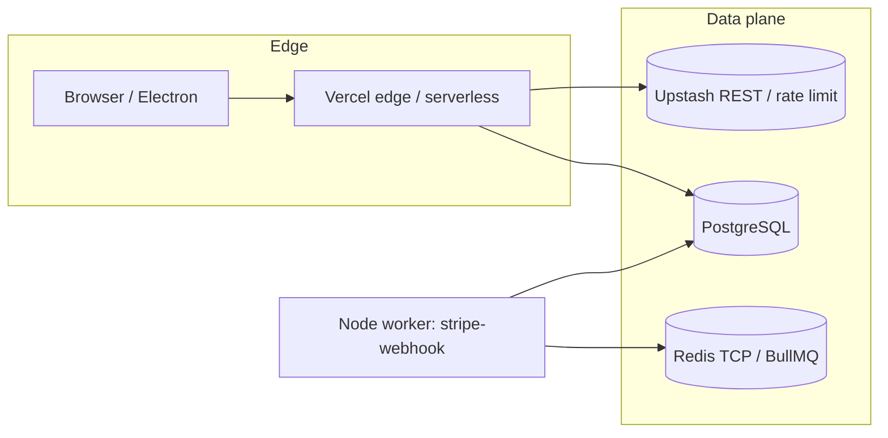

# Deployment topology (reference)

This snapshot describes **where runtime components live** for the AL-baz monorepo. It is a planning aid, not an SLA.

## Request path (simplified)

## Components

| Component | Typical hosting | Notes |
|-----------|-----------------|--------|
| **Root Next app** (`app/`) | Vercel (or self-hosted Node) | API routes, webhooks, customer surfaces that share the root app. |
| **Workspace apps** (`apps/admin`, `apps/vendor`, …) | Separate Vercel projects or local Electron hosts | Same API patterns; avoid drift — see `docs/API_WORKSPACE_PARITY.md`. |
| **Postgres** | Managed Postgres (Neon, RDS, etc.) | Prisma migrations under `prisma/`. Pooling (e.g. PgBouncer) recommended before very high concurrency. |
| **BullMQ** | Redis with `REDIS_HOST` | Queue names in `lib/cache.ts`; Stripe offload uses `stripe-webhooks` when enabled — see `docs/BACKGROUND_JOBS_AND_REDIS.md`. |
| **Rate limiting** | Upstash REST (`UPSTASH_REDIS_*`) | In-memory fallback is dev-only; prod should set Upstash — see `scripts/verify-deploy-env.mjs`. |
| **Stripe** | Stripe API + webhooks | Webhook endpoint on root app; optional async worker. |

## Workers

Processes that **must** run outside the serverless request lifecycle when queue mode is on:

- `npm run worker:stripe-webhook` — consumes `stripe-webhooks`.

Other queues (`orders`, `notifications`, `analytics`) are defined in code; if enqueued in production, each needs a matching consumer or jobs will accumulate.
