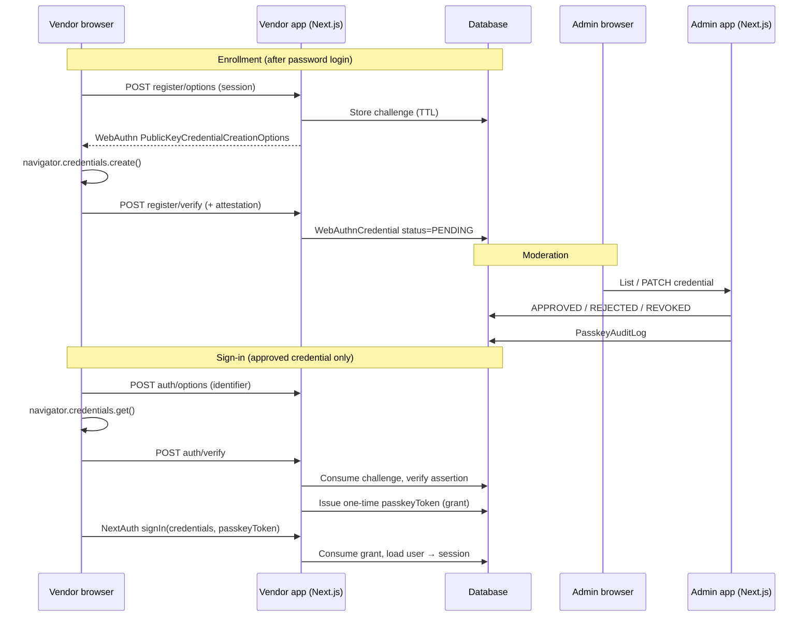

# How WebAuthn passkeys work (Albaz)

This document describes **FIDO2 / WebAuthn passkeys** used for vendor sign-in and device enrollment. It is separate from **subscription passkeys** (one-time activation codes for subscriptions).

---

## Two different “passkey” concepts

| Concept | Purpose | Where it lives |
|--------|---------|----------------|
| **WebAuthn passkey** | Passwordless sign-in with a device-bound cryptographic key (Touch ID, Windows Hello, security key, etc.) | `WebAuthnCredential` and related tables; vendor + admin WebAuthn APIs |
| **Subscription passkey** | Legacy / billing flow: admin-generated code tied to a subscription | `SubscriptionPasskey` model; admin “subscription passkeys” UI |

Do not confuse the two when debugging or naming features in support tickets.

---

## High-level architecture

---

## Feature flags and relying party (RP)

Everything is gated until both flags are enabled:

| Variable | Used for |
|----------|----------|
| `ALBAZ_FEATURE_WEBAUTHN_PASSKEYS` | Server APIs: registration, authentication, admin moderation |
| `NEXT_PUBLIC_ALBAZ_FEATURE_WEBAUTHN_PASSKEYS` | Client UI: vendor settings card, login “sign in with passkey”, admin Passkeys tab |

WebAuthn requires a consistent **relying party** (hostname + HTTPS in production):

| Variable | Meaning |
|----------|---------|
| `ALBAZ_WEBAUTHN_RP_ID` | RP ID (usually the registrable domain, e.g. `localhost` or `vendor.example.com`) |
| `ALBAZ_WEBAUTHN_ORIGIN` | Full origin where the vendor registers/asserts (e.g. `https://vendor.example.com`) |
| `ALBAZ_WEBAUTHN_RP_NAME` | Human-readable name shown in the authenticator UI |

Defaults fall back from `NEXTAUTH_URL` when some values are omitted; see `lib/webauthn/config.ts`.

Copy-ready examples live in `ENV_TEMPLATE.md` and the per-app `.env.example` files.

---

## Data model (Prisma)

- **`WebAuthnCredential`** — One row per enrolled authenticator: `credentialId`, `publicKey`, `counter`, `transports`, optional `nickname`, and **`status`** (`PENDING` → `APPROVED` / `REJECTED` / `REVOKED`). Only **`APPROVED`** credentials participate in authentication.
- **`WebAuthnChallenge`** — Short-lived server challenges for registration or authentication (`purpose`: `REGISTRATION` | `AUTHENTICATION`). Marked consumed after a successful verify; expired rows are cleaned up.
- **`WebAuthnPasskeyAuthGrant`** — After a successful WebAuthn assertion, the server mints a **short-lived, one-time** opaque token (`passkeyToken`). The browser passes that token into **NextAuth** `signIn("credentials", { passkeyToken })`; the grant row is consumed when the session is established.
- **`PasskeyAuditLog`** — Append-only-style events for operations and moderation (see enum `PasskeyAuditAction` in `prisma/schema.prisma`).

---

## Enrollment lifecycle

1. The vendor signs in with the **normal password** (or other allowed method).
2. In vendor settings, they start **“Enroll passkey”**. The UI calls the registration API, which returns WebAuthn creation options bound to the signed-in user.
3. The browser invokes **`navigator.credentials.create()`** and sends the result to **register/verify**.
4. The server verifies the attestation with `@simplewebauthn/server` and stores a **`WebAuthnCredential`** with status **`PENDING`**.
5. An **admin** opens the Passkeys moderation UI (`apps/admin`), reviews pending credentials, and sets status to **`APPROVED`**, **`REJECTED`**, or later **`REVOKED`**.
6. Until approved, that credential **must not** be used for passkey sign-in.

---

## Sign-in lifecycle

1. On the vendor **login** page, the user enters their **email or phone** (identifier), then chooses passkey sign-in (when the public feature flag is on).
2. **`auth/options`** returns assertion options (allow credentials filtered to **approved** credentials for that user).
3. The browser runs **`navigator.credentials.get()`** and posts the assertion to **`auth/verify`**.
4. The server verifies the assertion (signature, challenge, origin, RP ID, counter anti-cloning, etc.), updates **`lastUsedAt`**, and creates a **`WebAuthnPasskeyAuthGrant`** (hashed at rest; raw token returned once to the client).
5. The client calls **NextAuth** `signIn` with **`passkeyToken`** in the credentials payload.
6. **`lib/auth.config.ts`** — In `Credentials.authorize`, if `passkeyToken` is present, **`consumePasskeyAuthGrant`** runs: the grant must exist, be unexpired, and unconsumed. On success the user is loaded; **`APPROVED`** user status is still required for the session user object.

Password login is unchanged and remains the fallback.

---

## Time-to-live (TTL) and replay hygiene

Defined in `lib/webauthn/common.ts`:

- **WebAuthn challenges**: **5 minutes** from issuance (`CHALLENGE_TTL_MS`).
- **Passkey auth grants** (`passkeyToken`): **2 minutes** (`AUTH_GRANT_TTL_MS`).

`lib/webauthn/maintenance.ts` runs best-effort cleanup of expired or consumed challenges and grants during flows so the tables do not grow without bound.

---

## HTTP API surface (reference)

**Vendor app** (`apps/vendor`), under session where noted:

| Method | Path | Role |
|--------|------|------|
| POST | `/api/auth/passkeys/register/options` | Start enrollment |
| POST | `/api/auth/passkeys/register/verify` | Finish enrollment → `PENDING` credential |
| GET | `/api/auth/passkeys/me` | List current user’s WebAuthn credentials |
| DELETE | `/api/auth/passkeys/me/[id]` | Vendor-initiated removal (sets credential to `REVOKED`) |
| POST | `/api/auth/passkeys/auth/options` | Start sign-in (identifier) |
| POST | `/api/auth/passkeys/auth/verify` | Finish sign-in → issue `passkeyToken` |

**Admin app** (`apps/admin`), admin session + CSRF as implemented:

| Method | Path | Role |
|--------|------|------|
| GET | `/api/admin/webauthn-passkeys` | List / filter credentials for moderation |
| PATCH | `/api/admin/webauthn-passkeys/[id]` | Approve, reject, or revoke |

---

## Security controls (summary)

- Feature flags disable all WebAuthn surfaces when off.
- Challenges and auth grants are **single-use** and **time-bounded**.
- Auth grants are stored as **hashes**; the raw token is only shown once to the client.
- Rate limiting and audit logging are applied on the WebAuthn routes (see implementation in each route and `lib/webauthn/audit.ts`).
- Admin moderation is restricted to authenticated admin flows.

---

## Operations checklist

1. Apply Prisma migrations so WebAuthn tables exist.
2. Set both feature flags and correct **RP ID / origin** for each environment.
3. Use **HTTPS** and a stable hostname in production (WebAuthn requires a secure context except for `localhost`).
4. After changing env vars, **restart** the Next.js dev servers or redeploy.

---

## Related files

| Area | Path |
|------|------|
| Feature gate (server) | `lib/webauthn/feature.ts` |
| RP / origin helpers | `lib/webauthn/config.ts` |
| Challenges, hashing, client metadata | `lib/webauthn/common.ts` |
| Auth grant issue/consume | `lib/webauthn/grants.ts` |
| NextAuth passkey path | `lib/auth.config.ts` (`passkeyToken` branch) |
| Short internal overview | `apps/vendor/docs/WEBAUTHN_PASSKEYS.md` |
| Env template | `ENV_TEMPLATE.md` |

---

## Troubleshooting

| Symptom | Things to check |
|---------|-------------------|
| UI never shows passkey | `NEXT_PUBLIC_ALBAZ_FEATURE_WEBAUTHN_PASSKEYS=true` and rebuild / restart |
| API returns “disabled” | `ALBAZ_FEATURE_WEBAUTHN_PASSKEYS=true` on the **same** app that serves the route |
| Registration works but sign-in fails | Credential still **`PENDING`**; admin must **approve** |
| WebAuthn errors in browser | `ALBAZ_WEBAUTHN_RP_ID` / `ALBAZ_WEBAUTHN_ORIGIN` must match the **actual** URL in the address bar |
| NextAuth rejects after verify | Grant expired (2 minutes) or already consumed; retry sign-in from step 1 |

If you need a minimal on-call summary, use `apps/vendor/docs/WEBAUTHN_PASSKEYS.md`; this document is the full picture.
